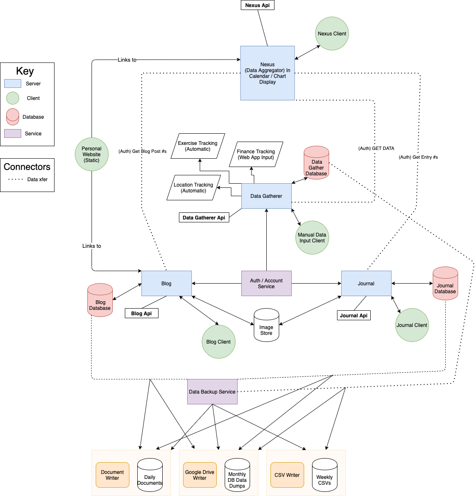

# Self Nexus

A collection of easily self-hostable micro-services intended for personal use.

# Requirements

Requirements for development or running locally

- [Docker](https://www.docker.com/) with [Docker-Compose](https://docs.docker.com/compose/install/)
- [Node.js](https://nodejs.org/en/) version 12.18.1. See [nvm](https://github.com/nvm-sh/nvm) to easily install and/or switch between Node.js versions

# Services

[auth-server](./services/auth-server): Server containing private key for JWT authorization. Signs JWTs and gives public key to other services to authenticate signed JWT. See diagram below from [this](https://stackoverflow.com/questions/56147281/use-jwt-to-authenticate-separate-api-microservice) SO answer that this pattern was derived from.

# Best Practices

## Package-lock.json

From https://stackoverflow.com/a/56254478:
1. Use `npm ci` in CI and when updating local machines with new packages.
2. Use `npm install <package>` when adding a new packages.
3. Commit changes to `package-lock.json` caused by modifying packages - Not changes caused by running `npm i`.

