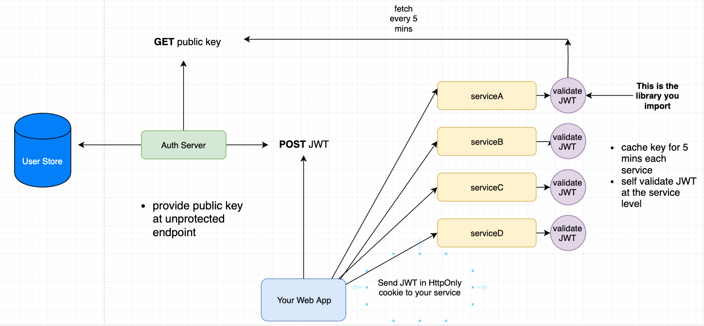

# Auth Server

The auth server holds the private key for singing JWT tokens and is the source of truth for user accounts.

Other services request the public key from this server for verifying the integrity of JWT tokens signed by this server.

See diagram below from [this](https://stackoverflow.com/questions/56147281/use-jwt-to-authenticate-separate-api-microservice) SO answer that this pattern was derived from.

